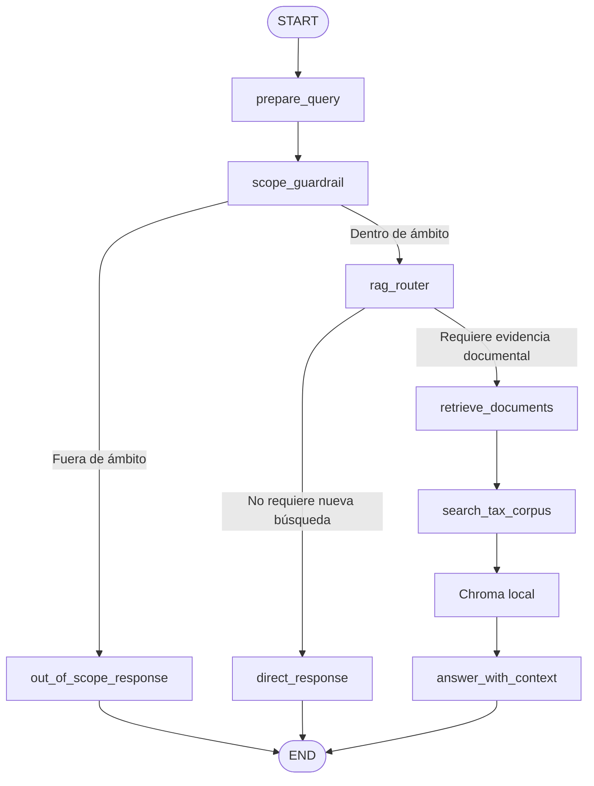

# GENAI_RAG_st — Asistente fiscal con Gemini, RAG, LangGraph y Streamlit

Aplicación conversacional especializada en fiscalidad española para **startups y pymes**. El sistema combina un corpus documental oficial, recuperación semántica local, generación con Gemini, orquestación con LangGraph y una interfaz de chat desarrollada con Streamlit.

> **Aviso:** las respuestas tienen carácter informativo y no sustituyen el análisis individualizado de un asesor fiscal.

---

## 1. Descripción del dominio elegido

El dominio del proyecto es la **fiscalidad empresarial española**, con especial atención a las necesidades habituales de empresas emergentes, startups y pequeñas y medianas empresas.

El asistente cubre principalmente:

- Impuesto sobre Sociedades.
- Ley de Startups y régimen de empresas emergentes.
- Certificación de empresa emergente.
- Tipo reducido aplicable a determinadas empresas.
- Deducciones fiscales por investigación, desarrollo e innovación tecnológica.
- Artículos 35 y 39 de la Ley del Impuesto sobre Sociedades.
- Aplicación y posible abono de deducciones por I+D+i.

### Fuentes documentales

El RAG se apoya en fuentes oficiales incorporadas previamente al vectorstore:

- **BOE**
  - Ley 27/2014, del Impuesto sobre Sociedades.
  - Ley 28/2022, de fomento del ecosistema de las empresas emergentes.
  - Orden PCM/825/2023, relativa a la certificación de empresas emergentes.
- **AEAT**
  - Manual práctico de Sociedades.
  - Información sobre el artículo 35.1 LIS: investigación y desarrollo.
  - Información sobre el artículo 35.2 LIS: innovación tecnológica.
  - Información sobre el artículo 39.2 LIS y deducciones excluidas del límite.

Las consultas vinculantes de la Dirección General de Tributos no forman parte del corpus actual.

---

## 2. Arquitectura de la solución

La aplicación utiliza los siguientes componentes:

| Componente | Tecnología | Función |
|---|---|---|
| Interfaz | Streamlit | Chat, estado visual y controles de sesión |
| Orquestación | LangGraph | Flujo, routing, memoria y streaming por nodos |
| LLM | Gemini mediante `ChatGoogleGenerativeAI` | Generación de la respuesta final |
| Embeddings | `paraphrase-multilingual-MiniLM-L12-v2` | Representaciones semánticas locales |
| Vectorstore | Chroma persistente | Recuperación de fragmentos del corpus |
| Tool | `search_tax_corpus` | Encapsula la búsqueda documental |
| Memoria | `InMemorySaver` + `thread_id` | Memoria conversacional durante la sesión |
| Guardrail | Reglas + similitud semántica local | Control del ámbito fiscal permitido |

### Flujo de LangGraph



Una consulta fiscal sustantiva recorre normalmente:

```text
Guardrail local → routing local → retrieval local → una llamada a Gemini → respuesta
```

Este diseño evita utilizar una primera llamada al modelo únicamente para decidir si debe consultar el RAG.

---

## 3. Justificación del system prompt

El `RAG_SYSTEM_PROMPT` se ha diseñado para resolver un problema frecuente en asistentes jurídicos o fiscales: que el modelo se limite a copiar o parafrasear la norma sin responder a la intención práctica del usuario.

### 3.1 Especialización y delimitación del rol

El prompt define al modelo como un asistente fiscal especializado en:

- Impuesto sobre Sociedades.
- Empresas emergentes.
- Deducciones por I+D+i.

Esta especialización reduce respuestas genéricas y mantiene la conversación dentro del dominio cubierto por el corpus.

### 3.2 Evidencia documental como fundamento, no como formato

Se indica expresamente que los documentos recuperados son la **evidencia de la respuesta**, pero no su formato. El objetivo es que Gemini transforme el contenido normativo en una explicación clara, en vez de reproducir literalmente artículos del BOE o fragmentos de la AEAT.

### 3.3 Respuesta práctica

El prompt obliga a:

- Contestar directamente a la pregunta.
- Explicar qué significa la norma para una startup o pyme.
- Responder «sí», «no» o «depende» cuando el usuario plantea si puede aplicar un incentivo.
- Enumerar requisitos y datos que la empresa debe comprobar.
- Señalar qué información falta cuando no puede alcanzarse una conclusión.

### 3.4 Reducción de alucinaciones

El modelo recibe instrucciones para no inventar:

- Artículos.
- Porcentajes.
- Plazos.
- Requisitos.
- Límites cuantitativos.
- Fuentes que no aparezcan en el contexto.

Si el contexto recuperado es insuficiente, debe reconocer la limitación en lugar de completar la respuesta con conocimiento no verificado.

### 3.5 Trazabilidad

La respuesta debe cerrar con las fuentes utilizadas, identificando, cuando los metadatos lo permiten:

- Organismo.
- Título del documento.
- Norma.
- Artículo o página.

### 3.6 Cautela profesional

La fiscalidad depende de los hechos concretos de cada empresa. Por ello, el prompt exige presentar las conclusiones como orientación condicionada e incluir una cautela cuando sea relevante.

### 3.7 Estructura uniforme

La estructura recomendada facilita la lectura y la evaluación:

1. **Respuesta directa**.
2. **Qué significa en la práctica**.
3. **Qué debes comprobar**.
4. **Fuentes**.
5. **Cautela**.

También existe un prompt separado para solicitudes conversacionales como «resúmelo», «hazlo más breve» o «ponlo en una tabla». Ese prompt impide introducir información fiscal nueva durante una simple reformulación.

---

## 5. Requisitos

### 5.1 Requisitos del sistema

- Python **3.12** recomendado.
- Git.
- Acceso a Internet:
  - para instalar dependencias;
  - para descargar el modelo de embeddings en la primera ejecución;
  - para llamar a la API de Gemini.
- Una clave válida de Gemini API.
- El vectorstore Chroma incluido en `data/vectorstore/chroma`.

### 5.2 Dependencias principales

El archivo `requirements.txt` debe incluir, como mínimo, las librerías utilizadas por la aplicación:

```text
streamlit
chromadb
langchain-core
langchain-chroma
langchain-google-genai
langchain-huggingface
langgraph
sentence-transformers
typing-extensions
```

Se recomienda conservar en `requirements.txt` las versiones que hayan sido probadas en el entorno local. Para obtener una captura completa del entorno:

```bash
python -m pip freeze > requirements-freeze.txt
```

No es recomendable mantener simultáneamente varios archivos de dependencias para el mismo despliegue, por ejemplo `requirements.txt`, `Pipfile` y `environment.yml`.

### 5.3 Configuración predeterminada

El runtime admite las siguientes variables:

| Variable | Valor predeterminado | Uso |
|---|---:|---|
| `CHROMA_COLLECTION_NAME` | `rag_fiscal_startups` | Colección de Chroma |
| `VECTORSTORE_DIR` | `data/vectorstore/chroma` | Ruta del vectorstore |
| `EMBEDDING_MODEL` | `sentence-transformers/paraphrase-multilingual-MiniLM-L12-v2` | Embeddings locales |
| `CHAT_MODEL` | `gemini-2.5-flash` | Modelo generativo |
| `RETRIEVAL_K` | `4` | Número máximo de chunks recuperados |
| `PRIORITY_K_PER_SOURCE` | `2` | Resultados por fuente prioritaria |
| `MAX_DOC_CHARS` | `1400` | Límite por documento |
| `MAX_CONTEXT_CHARS` | `5000` | Límite total del contexto RAG |
| `MAX_AGENT_OUTPUT_TOKENS` | `500` | Límite de salida del modelo |
| `THINKING_BUDGET` | `0` | Presupuesto de razonamiento |
| `MODEL_TEMPERATURE` | `0.2` | Variabilidad de la generación |
| `MODEL_TIMEOUT_SECONDS` | `60` | Timeout de la llamada al modelo |

---

## 6. API key de Gemini

La aplicación acepta:

```text
GOOGLE_API_KEY
```

como variable principal y:

```text
GEMINI_API_KEY
```


